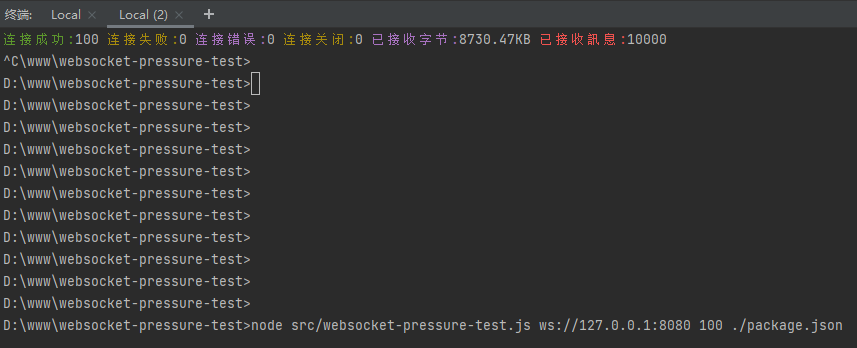

# ws-perf-test

nodejs版的websocket压力测试工具

### 安装

```shell
- 克隆代码仓库
    git clone https://github.com/chkch/ws_perf_test.git 
- 将本地项目全局安装到系统中
    npm install && npm install . -g 
    chmod +x /usr/local/bin/ws-perf-test 
- 压测使用
    ws-perf-test 地址 并发数 发送内容.json
    json文件格式：{} 或 [{},{}]
```


### 服务

提供一个简单的本地websocket服务 地址为 `ws://127.0.0.1:8080`  

```shell
websocket-server
```


### 运行

```shell
# 参数说明：
# node ws_stress.js [URL] [总连接数] [批次连接数] [批次间隔(ms)] [自定义JSON文件路径]
node ws_stress.js ws://127.0.0.1:9502 10000 500 1000 ./msg.json

•	10000 → 总连接数
•	500 → 每批连接数
•	1000 → 每批间隔（毫秒）
•	./msg.json → 发送的自定义消息文件（可选）
```




### License

[LICENSE](LICENSE)


